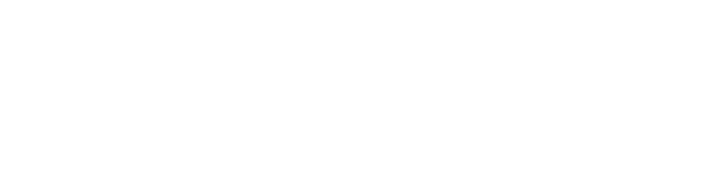
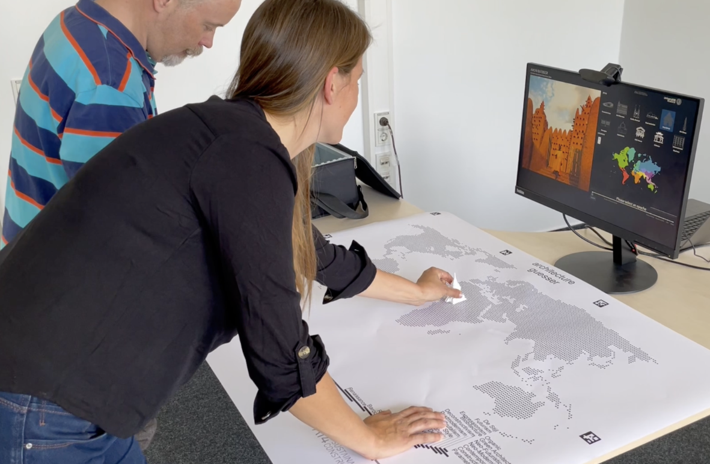
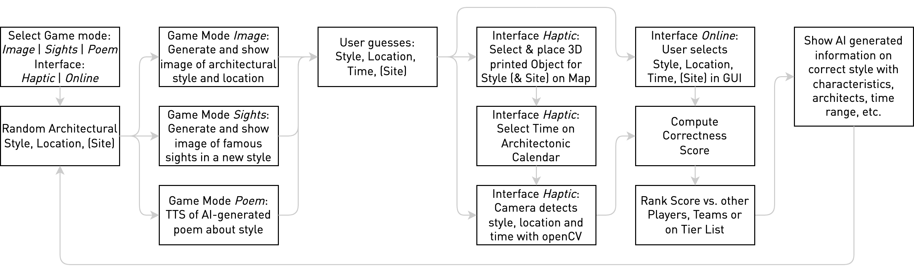

# Introduction
ArchiGuesser is an educational game that teaches our diverse architectural history across the globe using generative AI in various combinations. Using generative AIs is opening new possibilities to create content from text, speech, and images based on simple input prompts.

We created an educational game that combines various AI technologies from large language models and image generation to computer vision, in order to serve a single purpose: Teach users about architecture in an entertaining way. We wanted to enable students to explore and learn the diversity of our architectural history in a playful and exploratory way and at the same time experience and understand what current AI technologies can achieve.


# The Game
The game concept is simple: Generate and present an image/poem for a randomly drawn architecture style to the user and let them guess:
- What architectural style is presented?
- What region does it originate from?
- What time period does it stem from?

The user guesses by placing 3D-printed objects that represent the styles on a map. We modelled the 3D objects to represent common characteristic elements of each style. This adds a haptic element to the experience, which can improve learning and memorization and also offers hints should users be unsure about a guess.



The user receives points based on how close they are to the correct values (spatial distance to the region, temporal distance to the time period, and semantic distance in style). We then present the corrent style information such that the user can learn over time to remember the facts. The games are ranked on a leader board. This way the game can be played against oneself or against others many times due to the random generated content.


# Game architecture
We developed the game with the goal to create a multisensory experience that caters to different learning channels to teach architectural styles and also helps students understand the capabilities and workings of generative AI. Therefore, we decided that the content for the game should be generated primarily by AI including style descriptions, images, and poems. 





The figure above shows the pipeline ArchiGuesser is using to combine various AI technologies. More details can be found in the papers. The main design principles behind the pipeline are: 
- All content should be AI generated (style descriptions, images); 
- The game should be interactive and engage the users;
- The game should be multi-sensory to address multiple learning channels.

# Install
ArchiGuesser is using cached images generated with Midjourney and poems generated with ChatGPT and ElevenLabs. It is possible to generate these datasets as explained below. However, we recommend to install a zipped release under github releases as it contains the code and data. 

Please send us an email if someone wants to get the 3D models for the haptic interface.

# Run
ArchiGuesser is a webpage build on Python Dash. 

To run it we recommend to first create a python environment, e.g. with conda and then install all required packages via
```bash
pip install -r requirements.txt
```

Then the webpage can be run via:
```bash
python app.py
```

The application can also be build as docker/podman
```bash
podman build . -t ai4sc/archiguesser
podman run -p 8050:8050 ai4sc/archiguesser 
```


# Extend and recreate
## Collect style information from ChatGPT
The content of ArchiGuesser is generated with ChatGPT, Midjourney and ElevenLabs. The notebook

```bash
jupyter collect_data.ipynb
```

To run the notebook it is required to specify the environmental variable `OPENAI_API_KEY`.
The notebook will query information on all architectural styles in `datasets/architect_styles.csv`. It will populate the file `architect_styles.json`. The game is using a subselection of styles in the file `architect_styles_sub.json` that is generated from the main file based on the mapping in `selstylesmap` in the notebook to the worlds cultural zones.

## Generate poems with ElevenLabs
The notebook will generate poems describing the styles with ChatGPT. To activate this set in the notebook
- set `generate_poems=True` in the notebook
- set the `ELEVEN_API_KEY` environmental variable with your ElevenLabs API key
- set `<YOUR_VOICE_PROFILE>` in the notebook to the the ElevenLabs voice profile you want to use


## Generate images with Midjourney
The game uses a series of Midjourney images representing each style that is stored in `assets/style_generated`. The images are grouped in subfolders by style. 

The images are generated with prompts generated with the content extracted from ChatGPT. The prompts are generated by the notebook into the file `datasets/midjourney_queries.csv`. These prompts need to be executed on Midjourney and the resulting images need to be copied by style in `assets/style_generated`.

The icons for the various styles are also generated with Midjourney. We provided the macros `bw120.afmacro` and `invert120.afmacro` for Affinity Photo 2 to convert them into the 120x120 icon format used in the UI and on the game cards. The map `aruco_map4.pdf` and game cards `markers2.docx` can also be found in the `datasets` folder.

# Cite
We published and demoed the game at BuildSys and NeurIPS 2023, with an extended version at the latter.

```bibtex
@inproceedings{ploennigs2023archiguesser,
  title={ArchiGuesser - AI Art Architecture Educational Game},
  author={Ploennigs, Joern and Berger, Markus},
  booktitle={NeurIPS, Creative AI Track},
  year={2023}
}
```

```bibtex
@inproceedings{berger2023archiguesser,
  title={ArchiGuesser--Teaching Architecture Styles using Generative AI},
  author={Berger, Markus and Ploennigs, Joern},
  booktitle={BuildSys - ACM Int. Conf. on Systems for Energy-Efficient Buildings, Cities, and Transportation},
  pages={284--285},
  year={2023}
}
```
